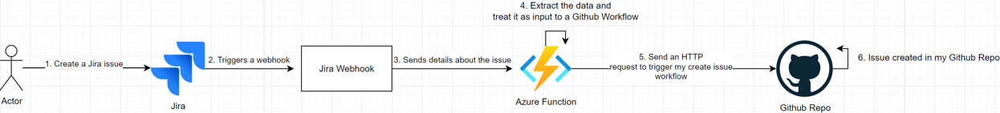

# Github Integration with Jira

## Overall Process

## Prerequisites

1. Create a public Github repo and include .github/workflows/issue_creation.yml in it
1. Navigate to Settings -> Developer Settings -> Personal access tokens
1. Generate a fine-grained token scoped to your Repo with `Read and Write access to actions, code, environments, issues, and workflows`.
1. Copy your token.
1. Go to your Azure Key Vault, and create a secret called `TOKEN` and paste your token from step 4.
1. Create an Azure function and paste the code in `azure_functions/github_jira_issues.cs` to your Azure function.
1. In the `string uri` variable in the code, replace `{GITHUB_USERNAME}` and `{REPO_NAME}`.
1. Copy the URL of your Azure function app
1. Create a [free Jira account](https://www.atlassian.com/software/jira/features)
1. Create a new Jira Software project and navigate to your project
1. In the top right, click on the cogwheel then click on System
1. In the left panel, scroll down and click on Webhooks
1. Create a webhook where the `created` event for Issue is ticked
1. Paste your Azure Function apps URL you copied in step 8 into the URL field of your webhook.

## Testing
1. Create a Jira Issue
1. View the `Actions` tab in your Github repo, and you should see that an action is being executed
1. After the issue creation action is finished, a new `Github Issue` will appear.